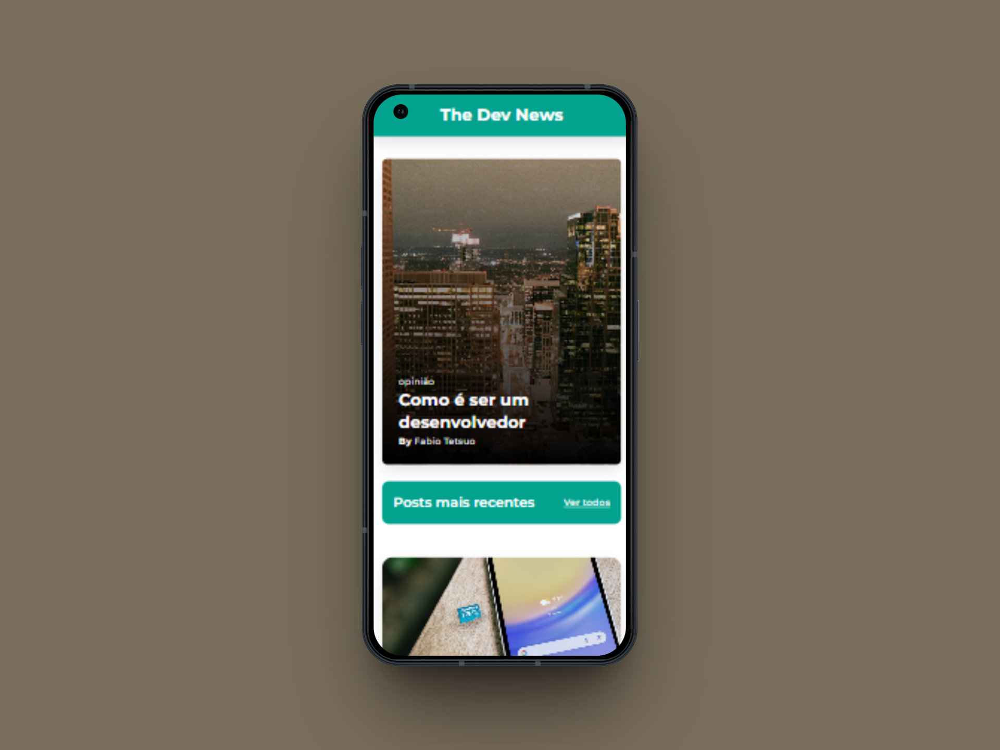
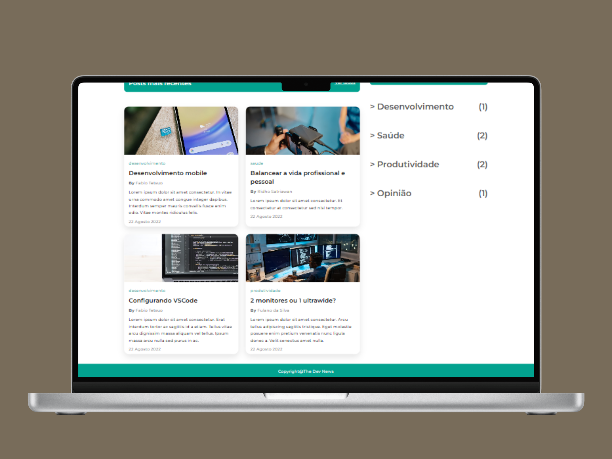
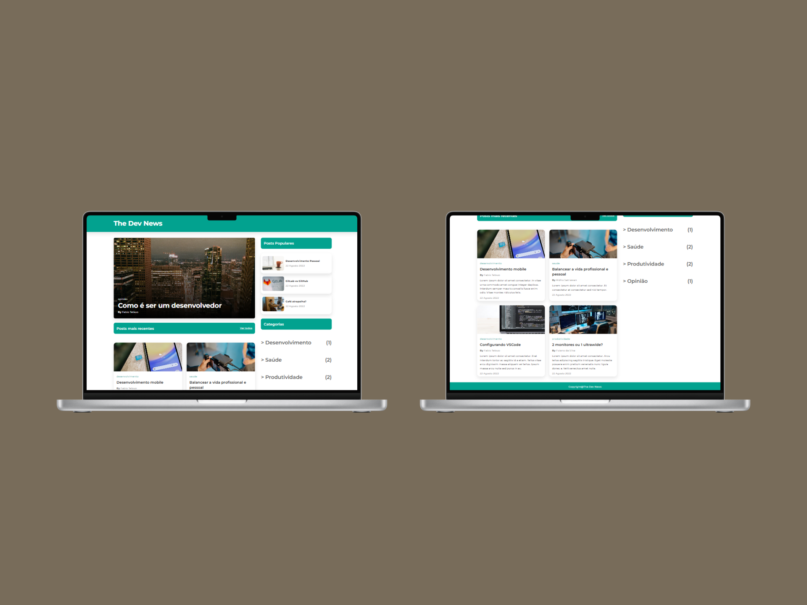

# The Dev News - Landing Page

Uma landing page simples para notícias e artigos sobre desenvolvimento, produtividade e tecnologia.

## Funcionalidades

- Banner principal com destaque de artigo
- Listagem de posts recentes
- Seção de posts populares
- Categorias de artigos
- Layout responsivo

## Estrutura

- **HTML**: Estrutura das seções principais (hero, posts, populares, categorias)
- **CSS**: Estilização responsiva, grid e flexbox
- **JavaScript**: Renderização dinâmica dos posts, populares e categorias

## Tecnologias e Metodologias

- **Mobile First**: O desenvolvimento foi realizado priorizando a experiência em dispositivos móveis, garantindo acessibilidade e usabilidade desde telas pequenas.
- **Media Queries**: Utilização de media queries para adaptar o layout e componentes conforme diferentes tamanhos de tela, proporcionando uma navegação fluida em desktops, tablets e smartphones.
- **CSS Grid e Flexbox**: Estruturação dos layouts com CSS Grid para divisão de colunas e Flexbox para alinhamento e distribuição dos elementos internos.
- **Componentização**: Os posts e seções populares são gerados dinamicamente via JavaScript, facilitando manutenção e escalabilidade do projeto.
- **Fontes Web**: Uso de fontes modernas via Google Fonts para melhor legibilidade e estética.

## Imagens

Mockup Mobile

Mockup Desktop

## Como usar

1. Clone o repositório
2. Abra o arquivo `index.html` em seu navegador
3. Edite os arrays de posts e categorias no `<script>` para personalizar o conteúdo
